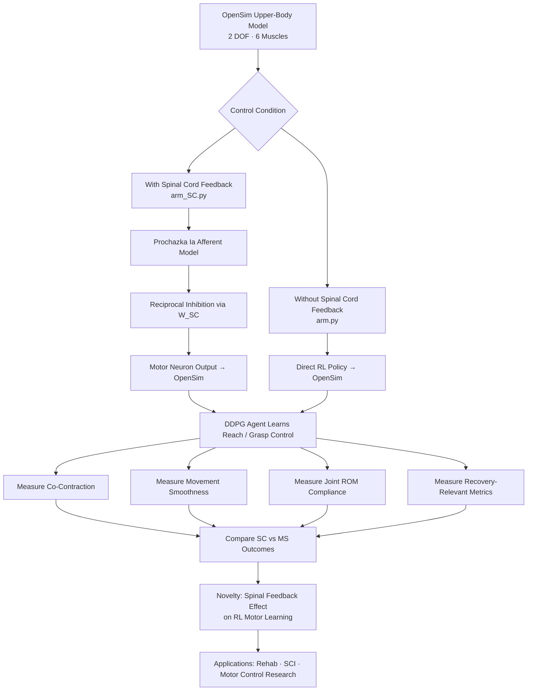

# osim-rl Spinal Cord Arm Project

> **A biologically grounded OpenSim-RL upper-extremity model that compares movement learning with and without spinal cord feedback to study reach control, co-contraction, and rehab-relevant recovery dynamics.**

A reinforcement learning environment for 2-DOF arm reaching using [OpenSim](https://opensim.stanford.edu/) and [osim-rl](https://github.com/stanfordnmbl/osim-rl), extended with a biologically-inspired spinal cord interneuron model. This project originated as master's-level research and is being developed toward a PhD-level research direction in computational neuroscience and motor rehabilitation.

---

## Research Overview

This project investigates how spinal cord feedback changes the way a reinforcement learning agent learns to control an upper-extremity musculoskeletal model. By comparing a **baseline musculoskeletal (MS) model** against a **spinal cord-augmented (SC) model**, the experiment targets key questions in motor neuroscience:

- Does spinal cord feedback improve muscle coordination and reduce co-contraction during reaching?
- Does Ia afferent-driven reciprocal inhibition produce more biologically realistic joint kinematics?
- Can spinal-level control improve robustness and recovery-relevant movement patterns?

These questions connect to translational goals in **spinal cord injury rehabilitation**, **motor learning research**, and **prosthetics control**.

---

## Research Flow



---

## Repository Structure

```
osim-rl-spinal-cord-arm-project/
├── arm.py                        # Base RL environment (Arm2DEnv, Arm2DVecEnv)
├── arm_SC.py                     # SC-extended environment (Prochazka Ia + W_SC)
├── train_arm.py                  # Train / test script for base MS model
├── train_arm_SC.py               # Train / test script for SC model
├── test_MS_agents.py             # Test harness for base model
├── test_SC_agents.py             # Test harness for SC model
├── pickle_MS_flexor_plots.py     # Plot BIC/BRA muscle data from saved pickle
├── pickle_MS_extensor_plots.py   # Plot TRI muscle data from saved pickle
├── pickle_SC_flexor_plots.py     # SC version of flexor plots
├── pickle_SC_extensor_plots.py   # SC version of extensor plots
├── pickle_SC_results.py          # Plot r_Ia and r_mn from SC results pickle
├── requirements_tf.txt           # Python dependencies
├── 20231207T2336/                # Archived training run (Dec 2023)
├── MS_Model_20/                  # Saved MS model weights (20k steps)
├── SC_Model_21/                  # Saved SC model weights (21k steps)
├── figures/
│   ├── MS_figures/               # Output plots for base model (auto-created)
│   └── SC_figures/               # Output plots for SC model (auto-created)
└── models/
    └── arm2dof6musc.osim         # OpenSim musculoskeletal model (2 DOF, 6 muscles)
```

---

## Muscles

The model includes 6 muscles across shoulder and elbow joints:

| Label     | Full Name                   | Action          |
|-----------|-----------------------------|-----------------|
| BIClong   | Biceps brachii (long head)  | Elbow flexor    |
| BICshort  | Biceps brachii (short head) | Elbow flexor    |
| BRA       | Brachialis                  | Elbow flexor    |
| TRIlong   | Triceps brachii (long)      | Elbow extensor  |
| TRIlat    | Triceps brachii (lateral)   | Elbow extensor  |
| TRImed    | Triceps brachii (medial)    | Elbow extensor  |

---

## Observation Space (34 values)

| Index | Description                                                        |
|-------|--------------------------------------------------------------------|
| 0–1   | Target x, y position (m)                                          |
| 2–7   | Shoulder: pos, vel, acc (3 values)                                |
| 8–13  | Elbow: pos, vel, acc (3 values)                                   |
| 14–31 | 6 muscles × 3: activation, fiber_length, fiber_velocity           |
| 32–33 | Wrist marker (r_radius_styloid) x, y (m)                         |

---

## Reward Function

The shaped reward has four components:

```
reward = 1.0
       - dist_penalty                    # squared wrist-to-target distance
       - 0.01  × Σ activation²           # metabolic effort (anti co-contraction)
       - 0.001 × Σ joint_velocity²       # smoothness (anti jerk)
       - 0.5   × joint_limit_violation²  # anatomical ROM soft barrier
```

**Joint limits enforced:**
- Shoulder: −30° to 120° (−0.5236 to 2.0944 rad)
- Elbow: 0° to 135° (0.0 to 2.3562 rad)

Weights are top-of-file constants in `arm.py` / `arm_SC.py` and easy to tune.

---

## Spinal Cord Model (`arm_SC.py`)

The SC layer sits between the RL policy output and OpenSim muscle activations:

1. **Prochazka Ia afferent rates** — computed from fiber length and velocity using the Prochazka (1999) model
2. **Sigmoid compression** — Ia rates passed through sigmoid to produce interneuron signals
3. **Reciprocal inhibition** — `W_SC` (6×6) matrix encodes Ia inhibitory interneuron projections from each muscle onto its antagonists
4. **Motor neuron output** — `r_mn = clip(sigmoid(W_SC @ r_Ia_s) + action, 0, 1)` — clamped to valid activation range before passing to OpenSim

---

## Quick Start

### Installation

```bash
# Recommended: use a conda environment with osim-rl
conda create -n osim-rl python=3.6
conda activate osim-rl
pip install osim-rl
pip install -r requirements_tf.txt
```

### Training

```bash
# Train base MS model (20 000 steps)
python train_arm.py --train --steps 20000

# Train SC model
python train_arm_SC.py --train --steps 20000

# Test saved weights
python train_arm.py --test --model train_arm20.h5f
python train_arm_SC.py --test --model train_SC21.h5f

# Pin a fixed target for debugging (disables random target generation)
FIXED_TARGET=1 python train_arm.py --test
```

> **Note:** The observation space changed from 16 → 34 in the latest refactor
> (fiber length and velocity restored to observation vector). Previously saved
> `.h5f` weight files trained on obs=16 are **incompatible** and must be retrained.

---

## Generating Plots from Saved Pickles

After a test run, pickle files are written to `figures/MS_figures/` or `figures/SC_figures/`.
Run the plot scripts from the repo root:

```bash
# MS model muscle plots
python pickle_MS_flexor_plots.py
python pickle_MS_extensor_plots.py

# SC model muscle plots
python pickle_SC_flexor_plots.py
python pickle_SC_extensor_plots.py

# SC r_Ia and r_mn plots
python pickle_SC_results.py
```

Output PNGs are saved to `figures/{MS,SC}_figures/custom_muscle_subplots/`.

---

## Novelty vs. Existing Work

| Dimension | Existing Work | This Project |
|-----------|--------------|--------------|
| Upper-limb OpenSim + RL | One published RL reaching study (simplified dynamics) | Full 6-muscle, 2-DOF model with biologically realistic fiber dynamics |
| Spinal cord feedback | Not included in RL reaching literature | Prochazka Ia model + reciprocal inhibition integrated into RL loop |
| Comparative design | Single model, no control condition | Explicit MS vs. SC comparison with matched training |
| Rehab metrics | Reward = task completion only | Co-contraction, smoothness, ROM compliance, recovery-relevant outcomes |
| Biological plausibility | Simplified activation | Muscle fiber length + velocity in obs space; spinal modulation of activations |

---

## Known Issues Fixed (April 2026 Refactor)

| File | Issue | Fix |
|------|-------|-----|
| `arm.py` | Reward = pure distance² → violent co-contraction | 4-component shaped reward |
| `arm.py` | No joint angle enforcement | Soft-barrier ROM penalty |
| `arm.py` | Hardcoded target overrode random generation | Removed override; `FIXED_TARGET` env var for debug |
| `arm.py` | `reward - 10` no-op in NaN handler | Fixed to `reward -= 10` |
| `arm.py` | Fiber length/velocity commented out of observation | Restored; obs size 16 → 34 |
| `arm_SC.py` | All of above + Prochazka `np.sign(0)` zeroed velocity term | Safe signed-power formulation |
| `arm_SC.py` | `np.log()` unguarded → `-inf`/`NaN` on tiny `max_v` | Clamped to ≥ 1e-6 |
| `arm_SC.py` | `r_mn = sigmoid(...) + action` unbounded | `np.clip(..., 0, 1)` before OpenSim |
| `arm_SC.py` | `_r_Ia/_r_mn = None` crashed logging before first step | Initialised to `np.zeros(6)` |
| `train_arm.py` | `args.train = False` hardcoded → `--train` flag ignored | Removed override |
| `train_arm.py` | Hardcoded `/home/reluctanthero/...` paths | Relative paths via `os.path.dirname(__file__)` |
| `train_arm.py` | `d_states` scope bug → only last test run plotted | Fixed to use `d_combined_states` |
| `train_arm.py` | `activation` y-label = `"N"` (wrong unit) | Fixed to `"[-]"` |
| `train_arm_SC.py` | All of above + `r_mn`/`r_Ia` KeyError if keys missing | `.get()` with `None` fallback |
| `test_MS_agents.py` | Scalar `d_states` init crashed on step 2 | Always wrap in list on first insert |
| `test_SC_agents.py` | Same scalar init crash | Same fix |
| `pickle_*.py` (all 5) | Hardcoded `/home/reluctanthero/...` paths | Relative paths |
| `pickle_*.py` (all 5) | Activation y-label `"N"` | Fixed to `"[-]"` |
| `pickle_SC_results.py` | Legend labels `["a","a","a","a","a","a"]` | Real muscle names |

---

## Dependencies

See `requirements_tf.txt`. Key packages:
- `opensim` (via conda / osim-rl)
- `keras` / `tensorflow`
- `keras-rl`
- `numpy`, `matplotlib`

---

## Author

**Nathan Wilkins**
Computational Neuroscience / Motor Control Research
McComb, MS · [GitHub](https://github.com/nathan-wilkins95)

*This project is being developed as a foundation for PhD-level research in computational neuroscience, spinal motor control, and rehabilitation engineering.*
